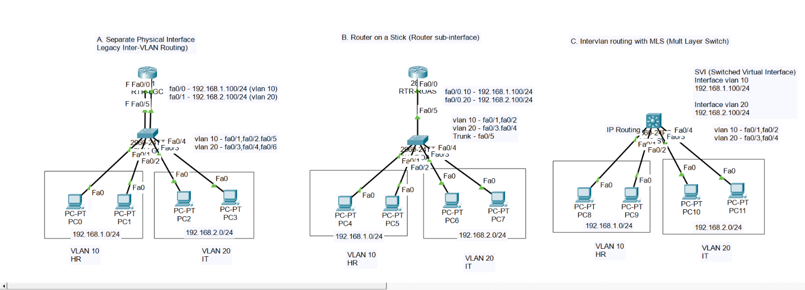

# CCNA Lab: Inter-VLAN Routing (3 Methods)

An enterprise network lab demonstrating three distinct approaches to Inter-VLAN routing in Cisco Packet Tracer: Legacy Inter-VLAN Routing, Router-on-a-Stick (ROAS), and Multilayer Switching (MLS/SVI).

---

## 📐 Network Topology


---

## 🎯 Implementation Methods

* **A. Legacy Inter-VLAN Routing:** Uses separate physical router interfaces for each VLAN (`Fa0/0` for VLAN 10 and `Fa0/1` for VLAN 20).
* **B. Router-on-a-Stick (ROAS):** Utilizes a single trunked physical interface (`Fa0/0`) divided into 802.1Q sub-interfaces (`Fa0/0.10` and `Fa0/0.20`).
* **C. Multilayer Switch (MLS):** Uses Layer 3 IP routing (`ip routing`) with Switched Virtual Interfaces (`interface vlan 10` and `interface vlan 20`).

---

## 🛠️ VLAN & IP Addressing Scheme

| VLAN ID | Department | Subnet Range | Gateway IP | Switch Ports |
| :--- | :--- | :--- | :--- | :--- |
| **VLAN 10** | HR | 192.168.1.0/24 | 192.168.1.100 | Fa0/1, Fa0/2 |
| **VLAN 20** | IT | 192.168.2.0/24 | 192.168.2.100 | Fa0/3, Fa0/4 |

---

## 🧪 Key Configuration & Verification Commands

```bash
# Enable IP Routing on Multilayer Switch (MLS)
Switch(config)# ip routing

# Verify VLAN assignment on switches
show vlan brief

# Verify 802.1Q trunk links
show interfaces trunk

# Verify active IP routing table
show ip route
