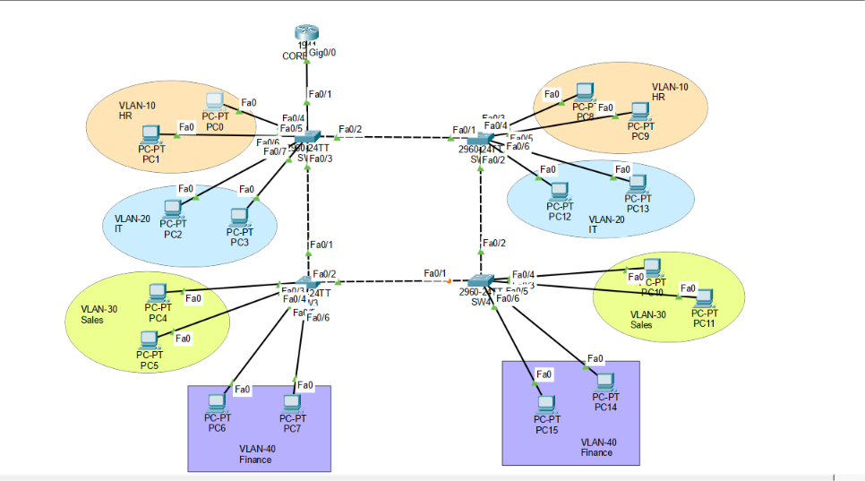

# CCNA Enterprise Lab: VLAN_Trunking

An enterprise-grade campus network topology designed in **Cisco Packet Tracer**, featuring multi-switch VLAN segmentation, **Spanning Tree Protocol (STP)** loop prevention, **802.1Q Trunking**, and **Router-on-a-Stick (ROAS)** Inter-VLAN routing.

---

## 📐 Network Topology & Architecture

This design represents a 4-switch campus infrastructure connected in a redundant ring topology to provide layer 2 resiliency while avoiding switching loops.



### Key Features
* **VLAN Segmentation:** 4 distinct departments isolated at Layer 2.
* **Spanning Tree Protocol (PVST+):** Configured SW1 as the **Root Bridge** (`spanning-tree vlan 1-40 root primary`) to prevent Layer 2 loops across the 4-switch redundant topology.
* **Trunking (802.1Q):** Inter-switch links and router-facing interface configured as Trunk ports carrying traffic for all active VLANs.
* **Inter-VLAN Routing:** Implemented Router-on-a-Stick on the CORE Router using 802.1Q sub-interfaces.
* **Static IP Addressing:** Standardized static IP assignment for end devices across all departments.

---

## 📊 VLAN & IP Subnet Scheme

| VLAN ID | Department / Name | Subnet Network | Default Gateway | Core Router Sub-interface |
| :---: | :---: | :---: | :---: | :---: |
| **VLAN 10** | HR | `192.168.10.0/24` | `192.168.10.1` | `Gig0/0.10` |
| **VLAN 20** | IT | `192.168.20.0/24` | `192.168.20.1` | `Gig0/0.20` |
| **VLAN 30** | Sales | `192.168.30.0/24` | `192.168.30.1` | `Gig0/0.30` |
| **VLAN 40** | Finance | `192.168.40.0/24` | `192.168.40.1` | `Gig0/0.40` |

---

## ⚙️ Configuration Summary

### 1. Spanning Tree Protocol (Root Bridge - SW1)
```ios
SW1(config)# spanning-tree mode pvst
SW1(config)# spanning-tree vlan 1,10,20,30,40 root primary
```

### 2. Trunking Configuration (All Switches)
```ios
Switch(config)# interface range fa0/1 - 4
Switch(config-if-range)# switchport mode trunk
```

### 3. Router-on-a-Stick (CORE Router)
```ios
CORE(config)# interface Gig0/0
CORE(config-if)# no shutdown

CORE(config)# interface Gig0/0.10
CORE(config-subif)# encapsulation dot1Q 10
CORE(config-subif)# ip address 192.168.10.1 255.255.255.0

CORE(config)# interface Gig0/0.20
CORE(config-subif)# encapsulation dot1Q 20
CORE(config-subif)# ip address 192.168.20.1 255.255.255.0

CORE(config)# interface Gig0/0.30
CORE(config-subif)# encapsulation dot1Q 30
CORE(config-subif)# ip address 192.168.30.30 255.255.255.0

CORE(config)# interface Gig0/0.40
CORE(config-subif)# encapsulation dot1Q 40
CORE(config-subif)# ip address 192.168.40.1 255.255.255.0
```

---

## 🔍 Verification & Testing

* **STP Verification:** Verified Root Bridge status on SW1 using `show spanning-tree vlan 10`. Confirmed blocking port (Amber light) on redundant switch link to prevent loops.
* **Ping Tests:** Executed ICMP tests between hosts across different VLANs (e.g., PC0 in VLAN 10 to PC15 in VLAN 40) achieving 100% success rate through ROAS.
